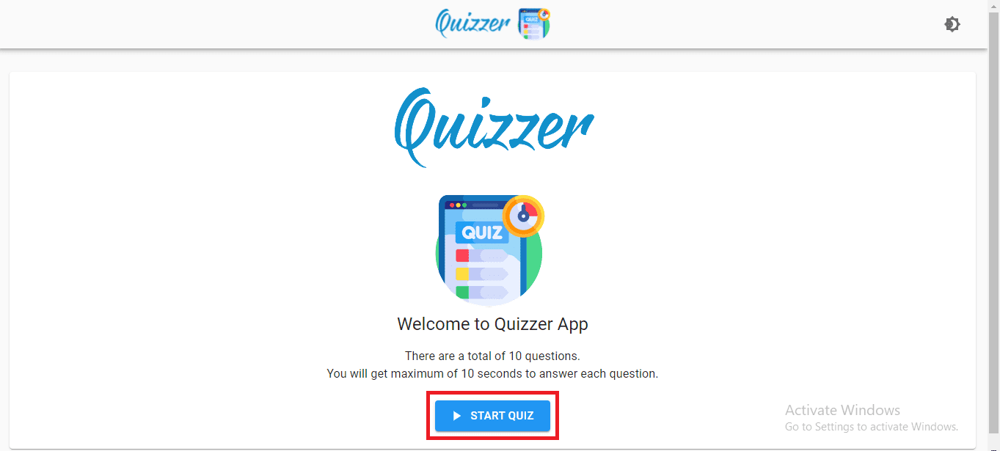
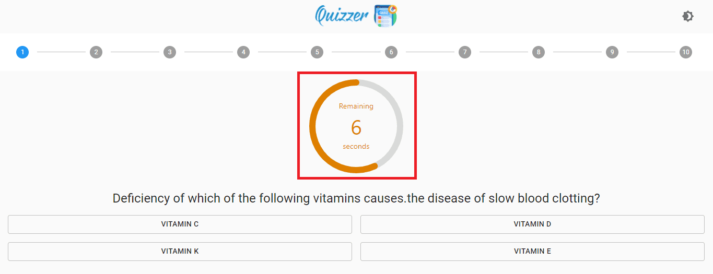
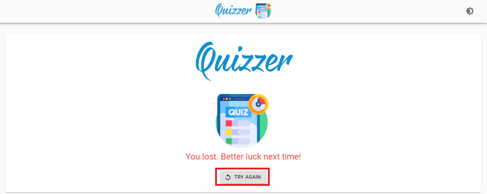
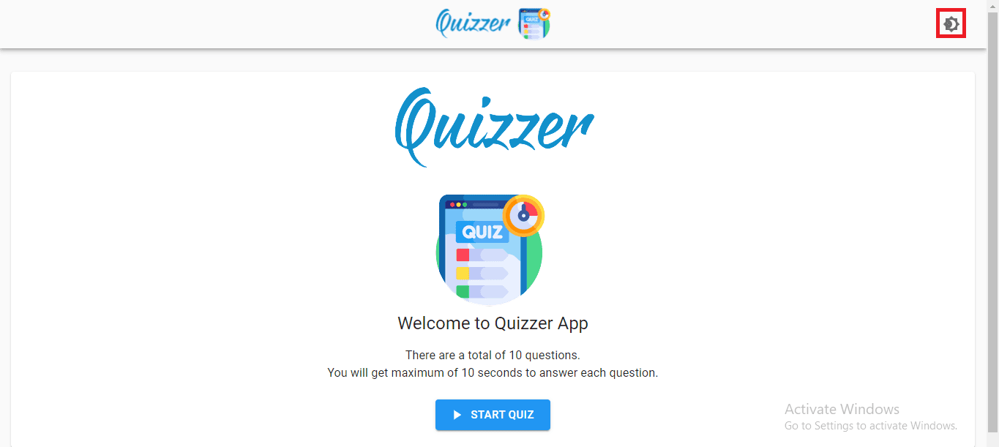
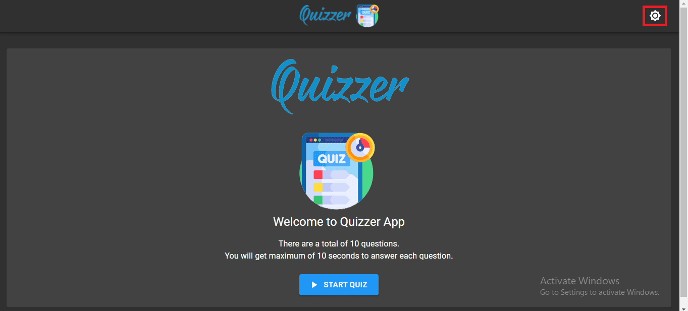
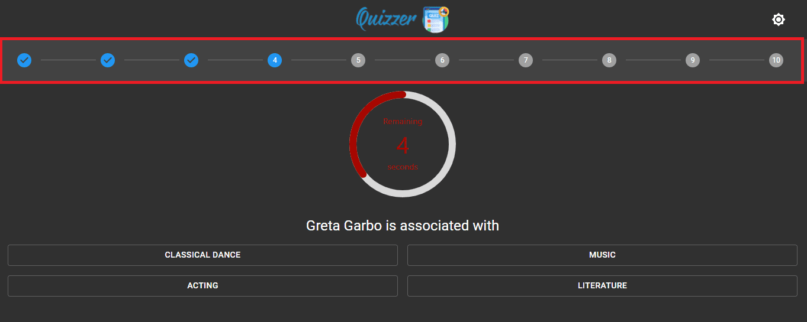
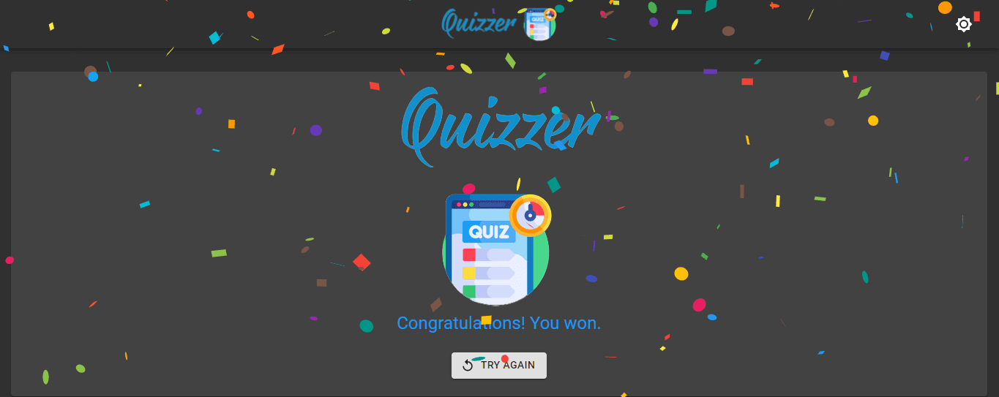
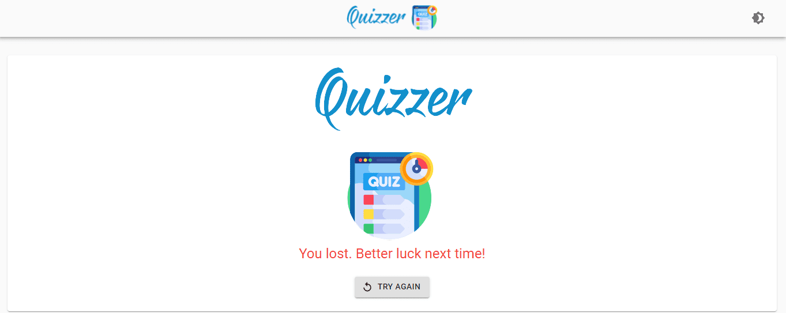

# Quizzer

This application is deployed and running on Netlify at [Quizzer](https://utkarsh-pathrabe-quizzer.netlify.app/).  

Quizzer is an interactive application designed for knowledge enthusiasts, especially suitable for students aged 9 and above. It offers a variety of general questions across different difficulty levels to enhance your knowledge.

## Key Features:

* Multiple-choice questions with a time limit for each question.
* Progress to the next question only upon providing the correct answer.
* Automatic quiz termination if the time limit is exceeded or an incorrect answer is given.
* User-friendly interface prioritizing ease of use.
* Two themes, Light and Dark, with the option to switch between them.
* Customizable question bank, allowing any number of questions.
* Adjustable settings for the number of questions and time per question.
* A stepper displays the number of questions and marks correct answers.
* Successfully answering all questions triggers a 'Congratulations! You won.' banner.
* Incorrect answers or time-outs result in a 'You lost. Better luck next time!' message.

Quizzer aims to create an engaging and flexible quizzing environment. Whether you're testing your knowledge or challenging yourself, Quizzer adapts to your preferences, making learning and quizzing fun and accessible.

## INTRODUCTION

* Quizzer application has general questions of varying difficulty levels.  
* It has multiple choice questions with time limit for each question and the next question appears only when you give correct answer of the current question.  
* It is good for students of 9+ years age as it helps in increasing their knowledge.  
* Just click on ‘START QUIZ’ button on the Home page to start the quiz.  

## PROBLEM DEFINITION

* Quizzer application is developed to conduct a quiz based on time constraint for answering each question.  
* Quiz is started by displaying one question with four options.  
  
* If the answer is correct, the next question will appear.  
* If the time exceeds the time limit for the current question or you give wrong answer for the current question, the quiz will end automatically and take you to the last page.  
* The ‘TRY AGAIN’ button will restart the quiz.  

   
## OBJECTIVE

* The main objective of ‘Quizzer’ is to create a user friendly environment for all users.  
* There are two themes: Light and Dark. You can change it anytime by clicking on symbol shown in the top right corner of the page. The theme will be preserved even after web-page refresh.  
  
  
* There can be any number of questions; you just have to prepare the question bank and the questions will be asked from that.  
* You can set the number of questions to be asked the time required per question as per your convenience.  
* There is a stepper on the top which shows how many questions are there in the quiz and if you give the correct answer it shows tick mark for that particular question.  
  
* If you give correct answer of the question in the given time, it will take you to the next question and so on, till you answer all the given questions.  
* If you give correct answers to all the questions, a banner will appear which will show ‘Congratulations! You won.’.  
  
* If you answer any of the question incorrectly or fail to give answer in allotted time, a banner will appear showing 'You lost. Better luck next time!'.   
   
